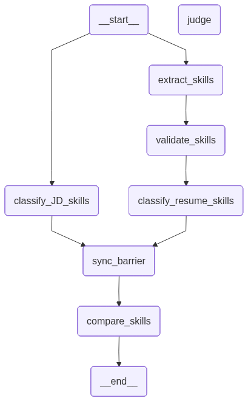

# LangGraph Resume Skills Matcher

A prototype that compares resume skills against a job description using a LangGraph workflow and an LLM (Gemini or OpenAI). An optional **judge** agent reviews the matching result and returns structured feedback.

## Workflow

The graph extracts and validates skills from the resume, classifies skills from both the resume and the JD (in parallel), then compares them and optionally runs a judge step.



## Setup

```bash
pip install -r requirements.txt
cp .env.example .env   # set GEMINI_API_KEY and/or OPENAI_API_KEY
```

## Monitoring with Langfuse

[Langfuse](https://langfuse.com) is used for observability: LLM calls (e.g. when using the OpenAI provider) are traced so you can inspect latency, token usage, and errors in the Langfuse dashboard. Set `LANGFUSE_SECRET_KEY` and `LANGFUSE_PUBLIC_KEY` in `.env` (and optionally `LANGFUSE_HOST`) to enable monitoring; the app will send traces when configured.

## Usage

- **Run matching** (writes comparison to `result.json` by default):
  ```bash
  python main.py cv.txt jd.txt
  ```

- **Run with judge** (also writes feedback to `feedback.json`):
  ```bash
  python main.py cv.txt jd.txt --judge
  ```

- **Print workflow graph** (saves PNG, or falls back to ASCII):
  ```bash
  python main.py --print-graph
  ```

- **Choose provider**: `-p gemini` or `-p openai` (default: openai). Use `-o` and `-f` to override output paths for comparison and judge feedback.

## Using judge feedback

The judge returns structured feedback (`quality_score`, `coherence_notes`, `completeness_notes`, `suggested_improvements`, `overall_verdict`, etc.) that you can use to:

- **Quality gate**: Filter or flag runs with low `quality_score` or verdicts like “use with caution” / “should be revised” so only reliable matches are used.
- **Prompt tuning**: Use `suggested_improvements`, `completeness_notes`, and `fairness_notes` to spot recurring issues (forced matches, missing skills, inconsistent scores), then adjust the extraction/comparison prompts and re-run to see if the judge’s scores improve.
- **Storing in a database**: Persist each run with its comparison and judge feedback (e.g. `run_id`, resume/JD refs, `comparison_result`, `judge_feedback`, `prompt_version`, timestamp). That gives you a history to analyse which prompt versions perform best (e.g. average `quality_score` per version) and to drive iterative prompt tuning to improve the match over time.

## Future improvements

- **Frontend**: Web UI to upload resumes and job descriptions, trigger runs, and view comparison and judge feedback.
- **Database**: Persist resumes, job offers, and results in a DB (e.g. PostgreSQL/SQLite) instead of plain text and JSON files; support history and search.
- **REST API**: Expose the workflow via an API (e.g. FastAPI) so the frontend or other clients can run matching without the CLI.
- **Caching**: Cache LLM responses for repeated inputs (e.g. same CV text) to cut cost and latency.
- **Batch mode**: Compare one CV against multiple JDs, or multiple CVs against one JD, with a single invocation.
- **Export**: Generate PDF or HTML reports (summary + detailed match/judge) for sharing.
- **Auth & multi-tenant**: User accounts and scoped data if multiple teams or organisations use the tool.
